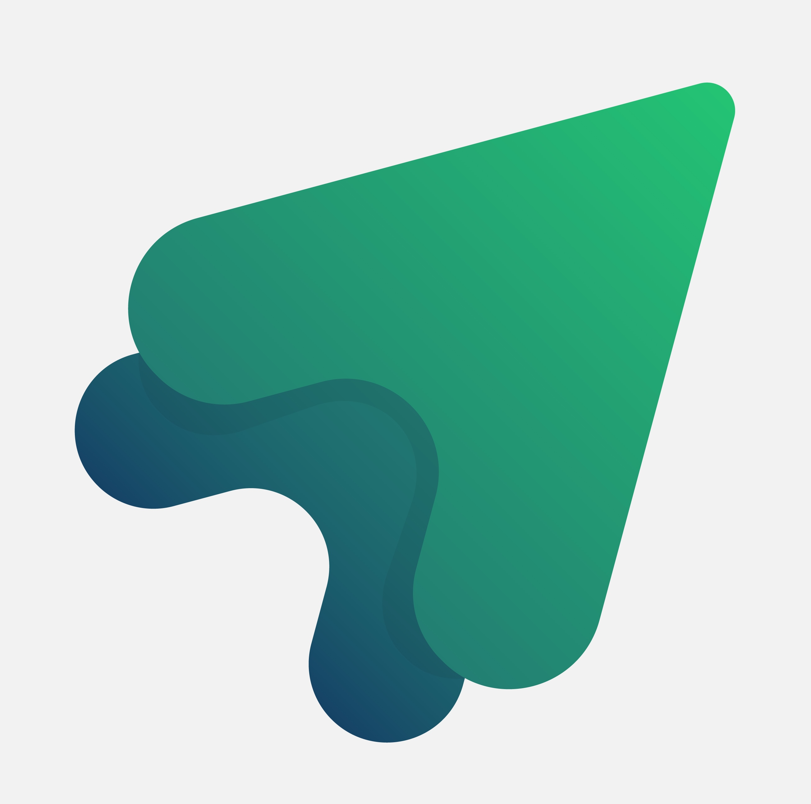

<h1 align="center">Welcome to Applyd!</h2>
<h3 align="center">Your personalized job application & calendar, all in one.
</h3>

Created by your 2024 ProDev Chairs at UCI's Management Information Student Society.

## About the Project

With the 2025 recruitment season fast approaching, MAISS@UCI's 2024 ProDev Chairs, Maggie and Caleb, searched for existing resources that members could use to simplify and condense the application tracking process.
However, no platform encompassed their vision.

On top of your traditional recruitment process tracker, we're working on implementing prodev-focused incentives to make the application process more enjoyable for all, regardless of your field. 
Utilizing RAG and AI, we hope to launch tailored internship recommendations based on members' fields of interests and current alumni connections. 

## Technologies Used

Built from scratch with:

[![Node][Node.js]][Node-url] [![React][React.js]][React-url] [![Tailwind-CSS][Tailwind]][Tailwind-url] [![Bootstrap][Bootstrap.com]][Bootstrap-url] [![Flask][Flask-Py]][Flask-url] [![Firebase][Fire-base]][Firebase-url]

[Node.js]: https://img.shields.io/badge/node.js-6DA55F?style=for-the-badge&logo=node.js&logoColor=white
[Node-url]: https://nextjs.org/](https://nodejs.org/en)
[React.js]: https://img.shields.io/badge/React-20232A?style=for-the-badge&logo=react&logoColor=61DAFB
[React-url]: https://reactjs.org/
[Bootstrap.com]: https://img.shields.io/badge/Bootstrap-563D7C?style=for-the-badge&logo=bootstrap&logoColor=white
[Bootstrap-url]: https://getbootstrap.com
[Tailwind]: https://img.shields.io/badge/tailwindcss-dbdbdb?style=for-the-badge&logo=tailwindcss
[Tailwind-url]: https://tailwindcss.com/
[Python]: https://img.shields.io/badge/python-3670A0?style=for-the-badge&logo=python&logoColor=ffdd54
[Python-url]: https://www.python.org/
[Flask-Py]: https://img.shields.io/badge/flask-%23000.svg?style=for-the-badge&logo=flask&logoColor=white
[Flask-url]: https://flask.palletsprojects.com/en/3.0.x/
[Fire-base]: https://img.shields.io/badge/firebase-a08021?style=for-the-badge&logo=firebase&logoColor=ffcd34
[Firebase-url]: https://firebase.google.com/
